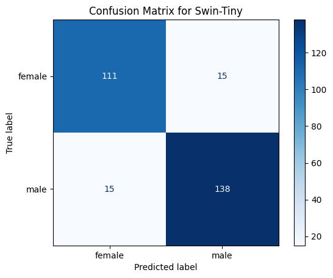
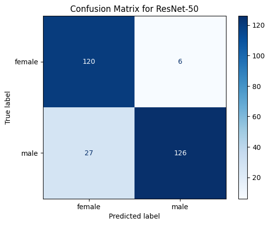
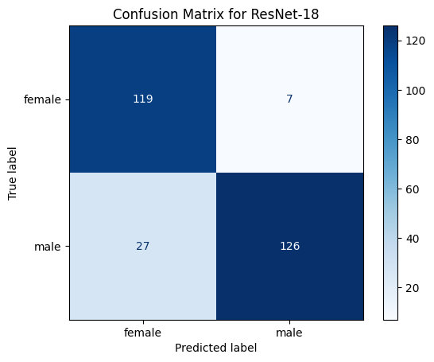
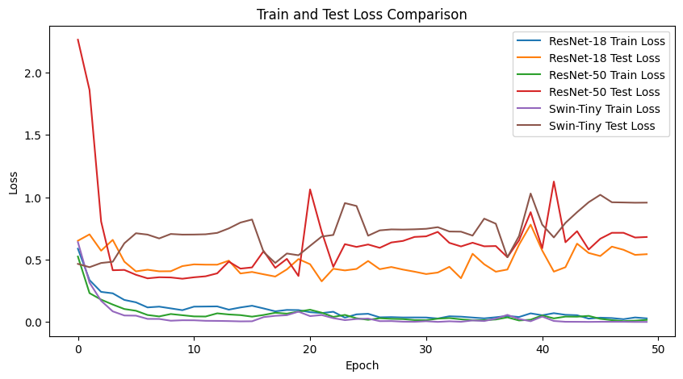

# Gender Classification using ResNet-18, ResNet-50, and Swin-Tiny Models

This repository presents a **Gender Classification** task using three different deep learning models: **ResNet-18**, **ResNet-50**, and **Swin-Tiny**. The dataset used is the **MiniJSRT Database** provided by the Japanese Society of Radiological Technology (JSRT).

---

## Table of Contents

1. [Overview](#overview)
2. [Dataset](#dataset)
3. [Models Used](#models-used)
4. [Results](#results)
5. [Performance Comparison](#performance-comparison)
6. [How to Run](#how-to-run)
7. [Visualizations](#visualizations)
8. [Conclusion](#conclusion)
9. [License](#license)

---

## Overview

The goal of this project is to classify gender (male or female) using chest X-ray images from the **MiniJSRT Database**. We implement and evaluate the performance of three models:
- **ResNet-18** (Convolutional Neural Network)
- **ResNet-50** (Deeper CNN)
- **Swin-Tiny** (Vision Transformer-based model)

The models are trained and tested, and their performances are compared using:
- **Confusion Matrices**
- **Loss Curves**

---

## Dataset

- **Name**: MiniJSRT Database  
- **Source**: Japanese Society of Radiological Technology (JSRT)  
- **Description**: A labeled chest X-ray image dataset with gender annotations.  
- **Data Split**:  
  - **Train**: 70%  
  - **Test**: 30%  

---

## Models Used

1. **ResNet-18**  
   - Lightweight model suitable for smaller datasets.  
   - Trained using PyTorch with data augmentation.  

2. **ResNet-50**  
   - Deeper version of ResNet-18, achieving better feature extraction.  

3. **Swin-Tiny**  
   - Vision Transformer-based model from Microsoft.  
   - Handles spatial relationships better for higher accuracy.

---

## Results

### Confusion Matrices

1. **Swin-Tiny**
   

2. **ResNet-50**
   

3. **ResNet-18**
   

---

### Performance Comparison

The Swin-Tiny model achieved the best performance compared to ResNet-18 and ResNet-50. Below are the metrics derived from the confusion matrices:

| Model         | Female Precision | Male Precision | Accuracy  |
|---------------|------------------|----------------|-----------|
| **Swin-Tiny** | 88.1%            | 90.2%          | **89.4%** |
| ResNet-50     | 81.6%            | 82.4%          | 84.6%     |
| ResNet-18     | 80.3%            | 82.4%          | 83.6%     |

---

### Loss Comparison

The training and test losses for all models are visualized below.



---

## How to Run

1. **Clone the Repository**:

   ```bash
   git clone https://github.com/your-username/gender-classification.git
   cd gender-classification
