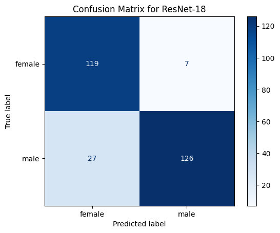
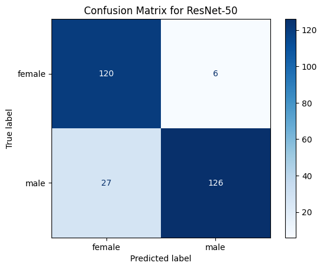
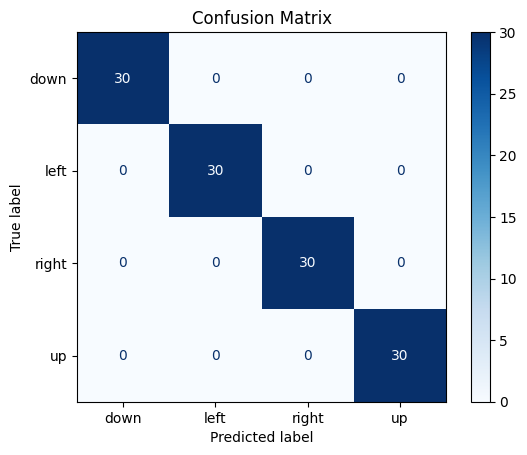
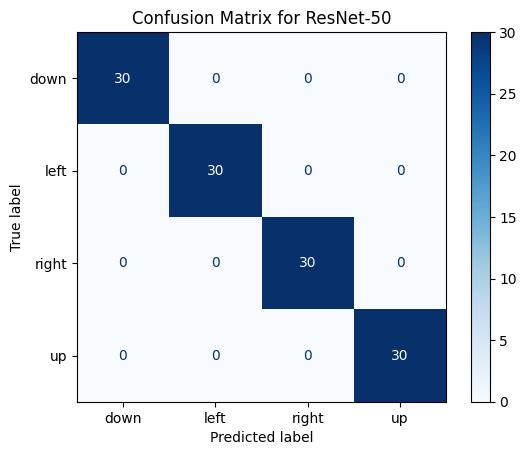
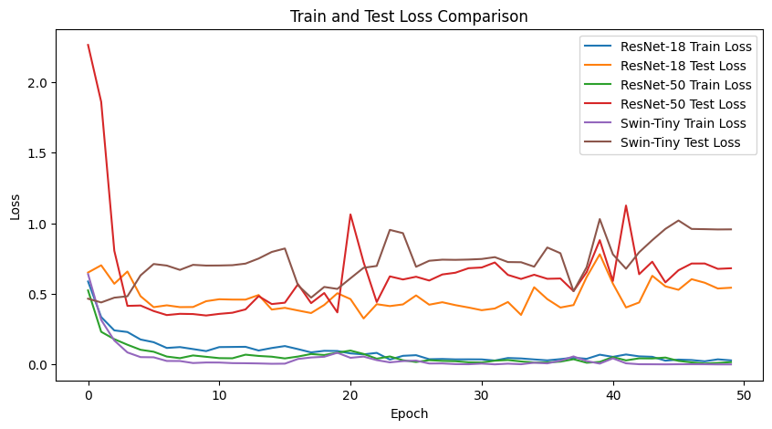

# Image Classification: Gender and Direction Tasks

This repository demonstrates **image classification tasks** for two use cases:
1. **Gender Classification**: Using the MiniJSRT dataset.
2. **Direction Classification**: Recognizing directions (up, down, left, right).

Both tasks are implemented and evaluated using **ResNet-18** and **ResNet-50** models. Their performances are compared based on:
- **Accuracy** (Confusion Matrices)
- **Loss Curves** (Training and Validation)

---

## Table of Contents

1. [Overview](#overview)
2. [Tasks and Dataset](#tasks-and-dataset)
3. [Models Used](#models-used)
4. [Results](#results)
5. [Performance Comparison](#performance-comparison)
6. [How to Run](#how-to-run)
7. [Visualizations](#visualizations)
8. [Conclusion](#conclusion)
9. [License](#license)

---

## Overview

This project evaluates the performance of **ResNet-18** and **ResNet-50** models on two classification tasks:
1. **Gender Classification**: Classify chest X-ray images as `male` or `female`.
2. **Direction Classification**: Classify image directions as `up`, `down`, `left`, or `right`.

---

## Tasks and Dataset

### 1. Gender Classification
- **Dataset**: MiniJSRT Database (Japanese Society of Radiological Technology).
- **Classes**: `male`, `female`.
- **Split**:
   - **Train**: 70%  
   - **Test**: 30%

### 2. Direction Classification
- **Dataset**: Custom dataset containing images labeled as directions:
  - Classes: `up`, `down`, `left`, `right`.
- **Split**:
   - **Train**: 70%  
   - **Test**: 30%

---

## Models Used

1. **ResNet-18**
   - A lightweight, efficient model for image classification.
   - Trained with data augmentation for robustness.

2. **ResNet-50**
   - A deeper variant of ResNet-18 with higher learning capacity.
   - Handles complex features at the cost of higher computational overhead.

---

## Results

### Gender Classification

#### Confusion Matrices

1. **ResNet-18**
   

2. **ResNet-50**
   

---

### Direction Classification

#### Confusion Matrices

1. **ResNet-18**
   

2. **ResNet-50**
   

Both models achieved **100% accuracy** on the test dataset, but ResNet-50 showed higher **loss** compared to ResNet-18.

---

### Loss Comparison

1. **Gender Classification Loss**:
   

2. **Direction Classification Loss**:
   - **ResNet-18**:
     
   - **ResNet-50**:
     

---

## Performance Comparison

### Gender Classification

| Model         | Accuracy  | Loss    |
|---------------|-----------|---------|
| **ResNet-18** | 83.6%     | Lower   |
| **ResNet-50** | 84.6%     | Higher  |

### Direction Classification

| Model         | Accuracy  | Loss    |
|---------------|-----------|---------|
| **ResNet-18** | 100%      | Lower   |
| **ResNet-50** | 100%      | Higher  |

---

## How to Run

1. **Clone the Repository**:

   ```bash
   git clone https://github.com/your-username/image-classification.git
   cd image-classification
